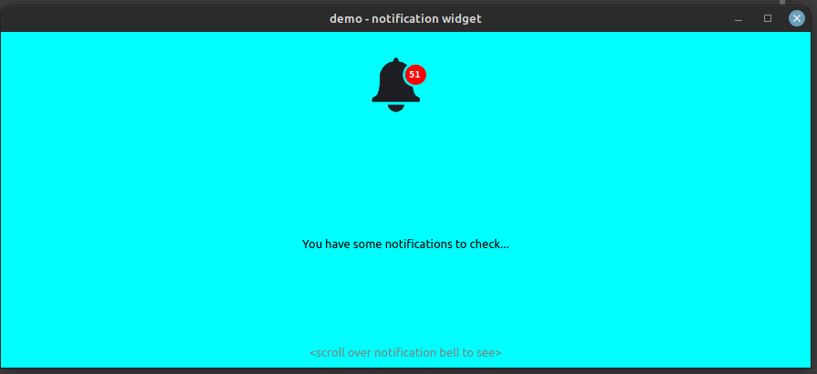

## Custom Widget to display notifications
<hr>

### Installation Required
```bash
$ pip install PyQt5
```

### Launching Application

```bash
python main.py
```

## Preview

<p align="center">
    
    <br>    
    <span>Preview image</span>
</p>
